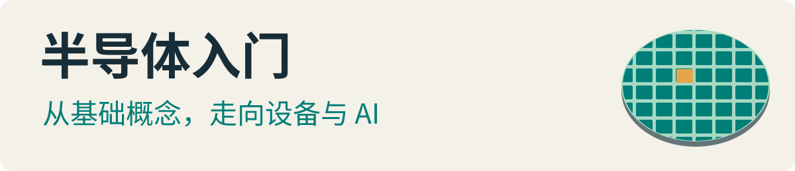
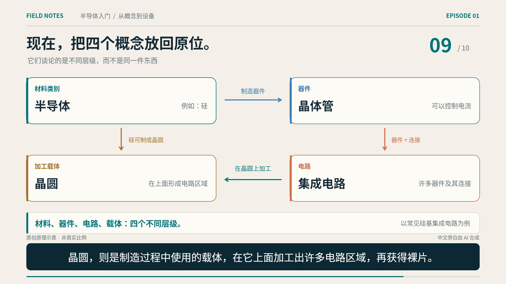

<p align="center">
  
</p>

# 半导体入门 · semiconductor-ai

**给零基础观众的中文科普动画：先看懂半导体，再理解芯片制造、设备公司与 AI。**

当前发布第一集**科普试播版**，不是已完成的五集课程，也未经过行业专家审校。

## 先看第一集

**《半导体、晶体管、芯片和晶圆，究竟是什么关系？》**

**[下载 MP4](https://github.com/alloevil/semiconductor-ai/raw/refs/heads/main/output/episode-01.mp4)** · [查看视频文件](output/episode-01.mp4) · [中文字幕](output/episode-01.zh-CN.srt) · [旁白与分镜](content/episode-01.md)

5 分 36 秒 / 1080p / 30 fps / 13.4 MiB / 中文 AI 配音 / 已内嵌中文字幕。

[](output/episode-01.mp4)

视频从四个容易混淆的名字出发，讲清晶体管、集成电路、晶圆、裸片与封装的关系，最后用三个问题复习。图形是原理示意，不按真实比例；推荐电脑或手机横屏全屏观看。

## 学习路线

1. **半导体基础** — 第一集已发布：材料、晶体管、芯片与晶圆。
2. **芯片制造** — 规划中：沉积、光刻、刻蚀、清洗与量测。
3. **产业链** — 规划中：设计公司、晶圆厂、设备商、材料商与封测厂。
4. **设备制造公司** — 规划中：研发、装配、调试、交付与维护。
5. **AI 应用** — 规划中：从业务问题、数据条件和验收指标出发。

## 不只有视频，也保留制作过程

- **JavaScript 原创动画**：Canvas 逐帧绘制，FFmpeg 导出 H.264 / AAC MP4。
- **可修改的内容**：旁白、分镜、参考来源和动画源码一起保存。
- **按语音编排**：使用句级时间边界对齐字幕，根据实际配音长度安排场景。
- **可断点重制**：旁白与渲染分段缓存，输入变化后重新生成对应产物。

没有使用参考视频的画面、音乐或旁白。参考资料的适用范围与简化边界见 [sources](content/references.md)。

## 验证证据

以下是本机实测，不是跨平台兼容性承诺：

- `npm run check`：**42 项检查通过**，全部 10,094 帧及音轨解码通过。
- Chrome 153 正常速度播完，12 个位置跳转通过；正常播放记录到 1 帧丢帧。
- 57 条字幕完整、无时间重叠，画面内最多两行。
- 十段最终音轨与源音轨在同一时间位置的波形相关系数均超过 0.99998。
- 检查了实际视频抽帧和横屏视口；**未进行人工逐句试听**。

[机器验收结果](output/verification.json) · [完整复验报告](output/review/复验报告.md) · [分镜总览](output/frames/storyboard.jpg)

## 本地重制

只想观看时，直接下载 MP4，无需安装工具。

重制要求 **Node.js ≥ 22、Python、uv、Noto CJK 中文字体**。当前字体路径针对 Linux；其他平台需调整 `scripts/art.mjs` 中的字体路径。npm 首次安装会下载 FFmpeg / ffprobe 二进制，语音重新生成需要网络。

```sh
git clone https://github.com/alloevil/semiconductor-ai.git
cd semiconductor-ai
npm ci
npm run prepare:audio
npm run preview
npm run render
npm run check
```

成片输出到 `output/episode-01.mp4`。仓库保留分段 MP3 与句级字幕缓存，不提交较大的中间 WAV、模型、依赖目录或浏览器会话。

| 想修改什么 | 文件 |
| --- | --- |
| 旁白与分镜 | [content/episode-01.md](content/episode-01.md) |
| 图形与动画 | [scripts/art.mjs](scripts/art.mjs) |
| 配音与字幕 | [scripts/prepare-audio.mjs](scripts/prepare-audio.mjs) |
| 视频导出 | [scripts/render.mjs](scripts/render.mjs) |
| 验收检查 | [scripts/verify.mjs](scripts/verify.mjs) |

完整操作方法与限制见 [制作说明](output/制作说明.md)。

## 发布与使用边界

- 本项目为科普试播内容，不是设备操作指南，不构成工艺或投资建议。
- 中文旁白由 AI 合成，使用 Microsoft `zh-CN-XiaoxiaoNeural`，通过 `edge-tts` 生成。**免密钥不等于取得任意传播或商用授权；相关服务的使用条款尚未完成核实。** 商业使用或再次分发前，应自行核实或替换为权利明确的配音。
- 尚未指定源码或内容的开源许可；仓库公开不代表授予任意复制、修改、再发布或商用权利。第三方依赖适用各自许可。
- 配音已做机器转写检查，但不能据此保证每个术语的发音正确；Safari、微信和其他设备播放器尚未实测。

发现知识错误、读音或画面问题，欢迎提交 [Issue](https://github.com/alloevil/semiconductor-ai/issues)，附上**视频时间点、问题描述和可核对的来源**。
